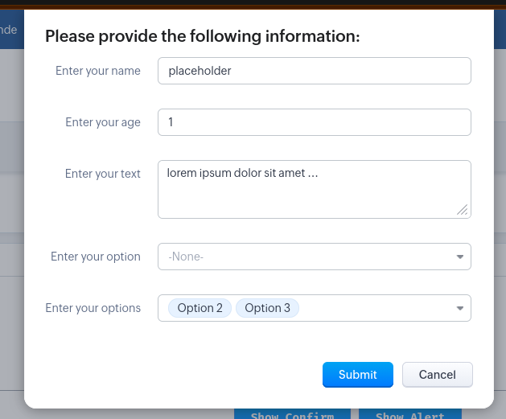
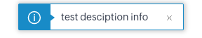
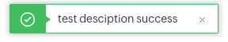
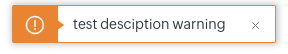
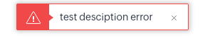
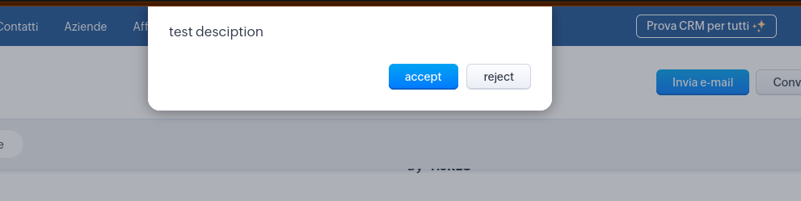
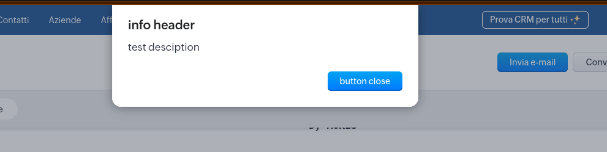

---
# try also 'default' to start simple
theme: seriph
# random image from a curated Unsplash collection by Anthony
# like them? see https://unsplash.com/collections/94734566/slidev
# background: /assets/images/background.png
# some information about your slides (markdown enabled)
title: Novità SDK JS per Zoho CRM
class: text-center
author: Maurizio Tolomeo
# https://sli.dev/features/drawing
drawings:
  persist: false
# slide transition: https://sli.dev/guide/animations.html#slide-transitions
transition: slide-left
# enable MDC Syntax: https://sli.dev/features/mdc
mdc: true
# duration of the presentation
duration: 30min
---

# Novità SDK JS per Zoho CRM

Presentazione per team dev

Guida alle Funzionalità Client-Side (ZDK.Client)

La UI Diventa più facile e veloce

<div class="abs-br m-6 text-xl">
  <a href="https://github.com/slidevjs/slidev" target="_blank" class="slidev-icon-btn">
    <carbon:logo-github />
  </a>
</div>

<!--
The last comment block of each slide will be treated as slide notes. It will be visible and editable in Presenter Mode along with the slide. [Read more in the docs](https://sli.dev/guide/syntax.html#notes)
-->

---

# Cosa Scopriremo Oggi

- 1 Interazione con l'Utente

Scopri come raccogliere input, mostrare avvisi e conferme
con getInput, showAlert, showConfirmation e showMessage.

- 2 Gestione dello Stato

Impara a gestire operazioni lunghe e l'esperienza di
caricamento con showLoader e hideLoader.

- 3 Integrazione Avanzata

Esplora le potenzialità di comunicazione bidirezionale con
openPopup e sendResponse per widget personalizzati.

- 4 Le Zoho Request Client

Analizzeremo le ZRC per effettuare chiamate REST dentro i
widget (una sorta di invoke 2.0).

---

# Concetti Fondamentali

Namespace e Sintassi

Tutte le funzioni sono accessibili tramite l'oggetto
ZDK.Client:

```javascript
ZDK.Client.showAlert(...)showConfirmation.
ZDK.Client.getInput(...)Soluzione: Chiama sempre hideLoader() prima di
ZDK.Client.openPopup(...)mostrare una finestra di dialogo.
```

Supporto Markdown
Formattazione ricca per comunicare in modo efficace:

```markdown
**testo** → testo (Grassetto)
_testo_ → testo (Corsivo)
<a href="..."> → link cliccabili
```

⚠ ATTENZIONE

Un loader attivo (showLoader) blocca l'apertura di
altri popup come showAlert, getInput, e showConfirmation.

---

# getInput(): Raccolta Dati Flessibile

La funzione getInput() permette di raccogliere dati dall'utente attraverso finestre di input personalizzate, supportando
molteplici tipi di campo per adattarsi a ogni esigenza.

## Tipi di Campo

Text, number, textarea, picklist e multiselect per qualsiasi scenario.

## Sintassi Intuitiva

getInput(options, heading, accept_message, reject_message)

## Configurazione Avanzata

Valori predefiniti, liste personalizzate e validazione integrata.

---
layout: two-cols
---

<template v-slot:default>
<div class="px-6">
```javascript
/**
 * Note: The presence of an active loader restricts the availability of other pop-ups.
 * Open popup widget and await a response from the widget's $Client.close(). 
 * Moreover, custom data can be passed to widget's
 * 'PageLoad' event. Supported Widget SDK version >= 1.2.
 * @param config popup configuration
 *  - api_name: string : API name of the popup widget to be opened
 *  - type: string : Type of popup. (e.g., 'widget')
 *  - header?: string : Header text for the popup
 *  - close_icon?: boolean : Whether to show close icon
 *  - close_on_escape?: boolean : Whether to allow closing on escape key press
 *  - animation_type?: 1 | 2 | 3 | 4 | 5 | 6 : Animation type for popup appearance
 *      `1` - slides popup from top
 *      `2` - slides popup from right
 *      `3` - slides popup from left
 *      `4` - slides popup from bottom
 *      `5` - fades in and fades out the popup
 *      `6` - zoom in and zoom out the popup
 *  - bottom?: string : Bottom position of the popup
 *  - right?: string : Right position of the popup
 *  - height?: string : Height of the popup (e.g., '400px', '50%')
 *  - width?: string : Width of the popup (e.g., '600px', '80%')
 *  - top?: string : Top position of the popup
 *  - left?: string : Left position of the popup
 * @param data custom data to be passed to popup widget's 'PageLoad' event
 * @returns object | string | number | boolean : Response from widget's $Client.close()
 */
```
</div>
</template>
<template v-slot:right>
<div class="mt-8 px-6">
```javascript
ZDK.Client.getInput(
openPopup: (
  config: {
    api_name: string
    type: 'widget'
    header?: string
    close_icon?: boolean
    close_on_escape?: boolean
    animation_type?: 1 | 2 | 3 | 4 | 5 | 6
    height?: string
    width?: string
    top?: string
    left?: string
    bottom?: string
    right?: string
  },
  data: Record<string, any>
) => Promise<object | string | number | boolean>
```
</div>
</template>

---

# Esempio Pratico di getInput()

<pre class="custom-language-javascript">
<code>
  ZDK.Client.getInput(
  [
    {
      type: 'text',
      label: 'Enter your name',
      default_value: 'placeholder',
    },
    {
      type: 'number',
      label: 'Enter your age',
      default_value: '1',
    },
    {
      type: 'textarea',
      label: 'Enter your text',
      default_value: 'lorem ipsum dolor sit amet ...',
    },
    {
      type: 'picklist',
      label: 'Enter your option',
      list_options: [
        { actual_value: 'option_1', display_value: 'Option 1' },
        { actual_value: 'option_2', display_value: 'Option 2' },
        { actual_value: 'option_3', display_value: 'Option 3' },
      ],
    },
    {
      type: 'multiselectpicklist',
      label: 'Enter your options',
      default_value: ['option_2', 'option_3'],
      list_options: [
        { actual_value: 'option_1', display_value: 'Option 1' },
        { actual_value: 'option_2', display_value: 'Option 2' },
        { actual_value: 'option_3', display_value: 'Option 3' },
      ],
    },
  ],
  'Please provide the following information:',
  'Submit',
  'Cancel'
  )
</code>
</pre>

---

# Esempio UI di getInput()

<div class="w-full flex justify-center">

</div>

---

# Comunicazione con l'Utente

Le funzioni che seguono sono progettate per migliorare l'interazione con l'utente, offrendo modi semplici e intuitivi per mostrare messaggi, richiedere conferme e gestire notifiche.

Le funzioni includono:

- showMessage()
- showConfirmation()
- showAlert()

---
layout: two-cols
---

<template v-slot:default>
<div class="px-6">

- showMessage():

Scopo: Mostra messaggi informativi con un solo pulsante di conferma.

Casi d'uso: Notifiche all'utente, avvisi informativi, di successo, di warning o di errore.

Sintassi:

```javascript
/**
 * Show a toast message in Page with following markdown support.
 * Note: The presence of an active loader restricts the availability of other pop-ups.
 * Image Markdown not supported for showMessage.
 * Italics: _text_ Bold: *text* Underline: __text__
 * Strikeout: ~text~ Code: `text` Heading1: # text
 * Heading3: ### text Blockquote: !text
 * Hyperlink   - [click here](https://www.zoho.com)
 * @param message text to be displayed
 * @param options message options
 * @returns void
 */
```

</div>
</template>
<template v-slot:right>
<div class="mt-8 px-6">
```javascript
showMessage: (
  message: string,
  options?: {
    type?: 'success' | 'info' | 'warning' | 'error'
  }
) => void
```
</div>

</template>

---

# Esempio UI di showMessage()

```javascript
ZDK.Client.showMessage("test description", { type: "info" });
ZDK.Client.showMessage("test description", { type: "success" });
ZDK.Client.showMessage("test description", { type: "warning" });
ZDK.Client.showMessage("test description", { type: "error" });
```

<div class="w-full flex flex-col items-center justify-center gap-2 mt-8">




</div>

---

- showConfirmation():

Scopo: Richiede conferma dall'utente con opzioni di accettazione o rifiuto.

Casi d'uso: Conferme per azioni critiche, decisioni importanti.

Sintassi:

```javascript
/**
 * Note: The presence of an active loader restricts the availability of other pop-ups.
 * Show confirmation box with markdown support and accept/reject message.
 * @param message text to be displayed
 * @param accept_message accept button message
 * @param reject_message reject button message
 * @returns Boolean : Confirmation response
 */
showConfirmation: (
  message: string,
  accept_message?: string,
  reject_message?: string
) => Promise<boolean>
```

---

# Esempio UI di showConfirmation()

```javascript
ZDK.Client.showConfirmation("test description", "accept", "reject");
```

<div class="w-full flex justify-center mt-8">

</div>

---

- showAlert():

Scopo: Mostra messaggi all'utente che devono essere confermati con un click.

Casi d'uso: Notifiche che richiedono attenzione senza opzioni multiple.

Sintassi:

```javascript
/**
 * Note: The presence of an active loader restricts the availability of other pop-ups.
 * Show Alert message with markdown support.
 * @param message primary text to be displayed
 * @param heading heading to be displayed
 * @param accept_message accept button message
 * @returns boolean
 */
showAlert: (
  message: string,
  heading?: string,
  accept_message?: string
) => Promise<boolean>
```

---

# Esempio UI di showAlert()

```javascript
ZDK.Client.showAlert("test desciption", "info header", "button close");
```

<div class="w-full flex justify-center mt-8">

</div>

---

# Gestione dello Stato con il Loader

### Le funzioni showLoader() e hideLoader()

Gestisci l'esperienza utente durante operazioni che richiedono del tempo, come chiamate API esterne o
elaborazioni complesse.

Best Practice: Chiama sempre hideLoader() sia in caso di successo che di errore per evitare che l'interfaccia
rimanga bloccata.

Possibili Tipi di Loader:

- spinner: Copre l'intera pagina, e compare un pop-up con un cerchio che gira.
- vertical-bar: Copre l'intera pagina, e compare un pop-up con le barre verticali che si muovono.
- standard: Il classico loader delle Custom Function da pulsante.

---

# Esempio Pratico di showLoader() e hideLoader()

```javascript
// Mostra il loader
ZDK.Client.showLoader({
  type: "spinner",
  message: "Recupero dei dati in corso...",
});

fetch("https://api.example.com/data")
  .then((response) => response.json())
  .then((data) => {
    // Chiamata API completata, nascondi il loader
    ZDK.Client.hideLoader();
    ZDK.Client.showMessage("Completata!", { type: "success" });
  })
  .catch((error) => {
    // In caso di errore, nascondi comunque il loader
    ZDK.Client.hideLoader();
    ZDK.Client.showMessage("Errore durante il recupero dei dati.", {
      type: "error",
    });
  });
```

---

# Integrazione Avanzata con openPopup

Si possono creare flussi di comunicazione bidirezionale tra il widget e un secondo widget per offrire esperienze utente più ricche e interattive.

## Flusso di Comunicazione

1. Il widget A apre un popup (widget B) usando openPopup, passando dati personalizzati.
2. Il widget B riceve i dati, gli elabora e può inviare una risposta al widget A usando $Client.close().
3. Il widget A riceve la risposta e può aggiornare l'interfaccia o eseguire azioni basate su di essa.

---

Sintassi di openPopup e sendResponse

```javascript
/**
 * Note: The presence of an active loader restricts the availability of other pop-ups.
 * Open popup widget and await a response from the widget's $Client.close(). Moreover, custom data can be passed to widget's
 * 'PageLoad' event. Supported Widget SDK version >= 1.2.
 * @param config popup configuration
 *  - api_name: string : API name of the popup widget to be opened
 *  - type: string : Type of popup. (e.g., 'widget')
 *  - header?: string : Header text for the popup
 *  - close_icon?: boolean : Whether to show close icon
 *  - close_on_escape?: boolean : Whether to allow closing on escape key press
 *  - animation_type?: 1 | 2 | 3 | 4 | 5 | 6 : Animation type for popup appearance
 *      `1` - slides popup from top
 *      `2` - slides popup from right
 *      `3` - slides popup from left
 *      `4` - slides popup from bottom
 *      `5` - fades in and fades out the popup
 *      `6` - zoom in and zoom out the popup
 *  - bottom?: string : Bottom position of the popup
 *  - right?: string : Right position of the popup
 *  - height?: string : Height of the popup (e.g., '400px', '50%')
 *  - width?: string : Width of the popup (e.g., '600px', '80%')
 *  - top?: string : Top position of the popup
 *  - left?: string : Left position of the popup
 * @param data custom data to be passed to popup widget's 'PageLoad' event
 * @returns object | string | number | boolean : Response from widget's $Client.close()
 */
```

---

# Sintassi di openPopup

```javascript
openPopup: (
  config: {
    api_name: string
    type: 'widget'
    header?: string
    close_icon?: boolean
    close_on_escape?: boolean
    animation_type?: 1 | 2 | 3 | 4 | 5 | 6
    height?: string
    width?: string
    top?: string
    left?: string
    bottom?: string
    right?: string
  },
  data: Record<string, any>
) => Promise<object | string | number | boolean>
```

---

# Esempio Pratico (Widget A)

```javascript
ZDK.Client.openPopup(
  {
    api_name: "Test_Widget_2",
    type: "widget",
    header: "Sono un secondo widget",
    close_icon: true, // mostra l'icona di chiusura
    close_on_escape: false, // non permette di chiudere con ESC
    animation_type: 4,
  },
  {
    param_1: "test_value",
    param_2: 12345,
  },
);
```

---

# Esempio Pratico (Widget B)

```javascript
// Nel widget B
ZOHO.embeddedApp.on(event, (data) => {
  // ...
  // data contiene i parametri passati da widget A (param_1, param_2 ...)
});
ZOHO.embeddedApp.init();
// ...
// Quando si vuole inviare una risposta a widget A (questo fa chiudere il popup)
$Client.close({
  response: {
    test_response_1: "Response inviata a crmpartnerslib!",
    test_response_2: "test di parametro!",
  },
});
```

---

# Esempio UI di openPopup()

<div class="w-full flex justify-center mt-8">
<video src="./assets/video/openpopup.webm" controls>
</video>
</div>

---

# Le Zoho Request Client (ZRC)

Un SDK integrato in Zoho CRM che fornisce un modo unificato per effettuare chiamate REST su tutte le funzionalità developer-centric di Zoho CRM.

## Funzionalità Chiave:

- Richieste API CRM
- Richieste basate su Connessioni
- Richieste API Esterne

---

## Perché usare ZRC?

- Supporta qualsiasi versione delle API CRM
- Caricamento file tramite Connessione o API Esterne
- Sintassi consistente per le chiamate API
- Nessuna autenticazione necessaria per le chiamate API all'interno della
  stessa organizzazione
- Supporto Async/await per codice più pulito
- Istanze ZRC riutilizzabili
- Gestione automatica dei dati JSON
- Codifica automatica dei parametri di query

---

# Esempio Pratico di ZRC

## Esempio 1: Richiesta API CRM

```javascript
const users = await zrc.get('/crm/v8/users');

// Output:
{
  "status": 200,
  "data":
  {
    "users": [
      {
        "id": 3891457000000556001,
        "full_name": "Catherin",
        "email": "test@zoho.com",
        // ... altri campi utente
      }
      // ... altri utenti
    ]
  }
}
```

---

# Esempio Pratico di ZRC

## Esempio 2: Creazione di un record

```javascript
const deal = await zrc.post('/crm/v8/Deals', {
  data: [
    {
      Deal_Name: 'Nuova Opportunità',
      Stage: 'Qualification',
      Amount: 5000,
    }
  ]
});
// Output:
{
  "status": 201,
  "data":
  {
    "code": "SUCCESS",
    "message": "record added",
    "status": "success",
  }
}
```

---

# Esempio Pratico di ZRC

## Esempio 3: Istanze Riutilizzabili e Connessioni Esterne

```javascript
const sheetZrc = zrc.createInstance({
  baseUrl: "https://sheets.googleapis.com/v4",
  connection: "google_sheets",
});

const sheet_info = await sheetZrc.get("/spreadsheets/98711121211100");
const sheet_value1 = await sheetZrc.get(
  "/spreadsheets/98711121211102/values/A1",
);
const sheet_value2 = await sheetZrc.get(
  "/spreadsheets/98711121211102/values/A2",
);
```

---

# Conclusioni

- Le nuove funzionalità di ZDK.Client offrono strumenti potenti e veloci per l'interazione con l'utente e gestire lo stato dell'applicazione.
- La comunicazione bidirezionale tra widget consente esperienze utente più avanzate e personalizzate.
- Le Zoho Request Client (ZRC) semplificano le chiamate API.

## GRAZIE PER L'ATTENZIONE

## Domande?
